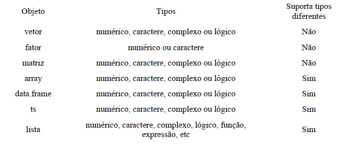

layout: true

<div class="my-footer">


</div>

---

## Estrutura do Curso

<div style="text-align: justify">

- Introdução ao R;

- Álgebra Matricial com R;

- Introdução aos Modelos de Insumo-Produto:
  
- Desdobramentos:

  - Modelo fechado;
  
  - Modelo pelo lado da oferta;
  
- Multiplicadores e Geradores;

- Índices de Ligação;

- Campo de Influência;

- Extração Hipotética;

- Decomposição Estrutural

---

## Referências

<div style="text-align: justify">

### Básicas:

GUILHOTO, J. J. M. **Análise de Insumo-Produto**: teoria e fundamentos. 2011. (MPRA Paper No. 32566).

GUILHOTO, J. J. M.; SESSO FILHO, U. A. Estimação da matriz insumo-produto a partir de dados preliminares das contas nacionais. **Economia Aplicada**, v. 9, n. 2, p. 277-299, 2005.

HADDAD, E. A. **Applied General Equilibrium Models I and II**. Núcleo de Economia Regional e Urbana da Universidade de São Paulo (NEREUS), 2020.

MILLER, R. E.; BLAIR, P. D. **Input Output Analysis**: foundations and extensions. Prentice Hall, 2009.

---

## Referências

<div style="text-align: justify">

### Complementares:

GROLEMUND, G. **Hands-on Programming with R**: write your own functions and simulations. O’Reilly Media, Inc., 2014.

WICKHAM, H.; GROLEMUND, G. **R for Data Science**: import, tidy, transform, visualize, and model data. O’Reilly Media, Inc., 2016.
---

## Metodologia

Todas as aulas serão realizadas no formato EAD, por meio da plataforma Microsoft Teams;

Os alunos devem dispor de computador e acesso à internet, para acompanhamento das aulas e atividades do curso;

Serão disponibilizados os scripts com os códigos desenvolvidos em aula, mas é extremamente recomendado que os alunos desenvolvam seus próprios códigos baseados no conteúdo exposto.

Horário das aulas: 19h-22h. Intervalo de 15 minutos.

---
## Aula 1 - Introdução ao R

### Instalação do R:

#### No Windows:
Para instalar o R no Windows, siga os seguintes passos:

1. Acesse o CRAN: https://www.r-project.org/

2. No menu à esquerda, encontre a opção Download e clique em CRAN.

3. Escolha a opção de servidor (mirror) mais próxima de você.

4. Clique na opção `base`.

5. Na nova página, clique em `"Download R x.x.x for Windows"`, sendo x.x.x o número da versão que será baixada. Se você teve algum problema com o download, tente escolher outro servidor no passo 3.

Feito o download, clique duas vezes no arquivo baixado e siga as instruções para instalação.

---
## Aula 1 - Introdução ao R

### Instalação do RStudio:

Agora vamos instalar a versão open source do RStudio, a IDE que utilizaremos para escrever e executar códigos em R.

Para instalar o RStudio no Windows, siga os seguintes passos:

1. Acesse a página de downloads da RStudio: https://rstudio.com/products/rstudio/download/#download

2. baixe a versão referente ao seu sistema operacional que está na lista de `All Installers`.

3. Clique duas vezes no arquivo que você baixou da página do RStudio e siga as instruções de instalação.
---
### Abrindo o RStudio

Ao abrir o RStudio, você verá 4 quadrantes: **editor**, o **console**, o **environment** e o **output**.   

```{r echo=FALSE, out.width='50%', fig.align="center", fig.cap="" }
knitr::include_graphics("img/rstudio1.png")
```

O **editor** e o **console** são os dois principais painéis do RStudio. Passaremos a maior parte do tempo neles.
---
## R Básico

### **Objetos, dataframes, matrizes, vetores e funções:**

**Objeto**: nome que guarda um determinado valor (Atenção, o R é *case sensitive* - diferencia maísculas de minísculas)

```{r echo=TRUE, eval=TRUE}
a <- 2
A <- 4

a
A
``` 
---
## R Básico

### **Objetos, dataframes, matrizes, vetores e funções:**

Tipos de objetos:

```{r echo=FALSE, out.width='90%', fig.align="center", fig.cap="" }

```
---
## R Básico

### **Objetos, dataframes, matrizes, vetores e funções:**

**Dataframe**: objetos bidimensionais (linhas e colunas) que guardam um conjunto de dados de **diferentes tipos**, a exemplo de uma base de dados.

```{r echo=TRUE, eval=TRUE}
a <- iris

class(a)

head(iris, 5)
``` 
---
## R Básico

### **Objetos, dataframes, matrizes, vetores e funções:**

**Matrizes**: objetos bidimensionais (linhas e colunas) que guardam um conjunto de dados **iguais**.

```{r echo=TRUE, eval=TRUE}
#exemplo 1 - matriz de 3x3
m <- matrix(data = c(1,2,3,4), nrow = 3, ncol = 3)

m
```
---
## R Básico

### **Objetos, dataframes, matrizes, vetores e funções:**

**Vetores**: vetores no R são apenas conjuntos indexados de valores. Para criá-los, basta colocar os valores separados por vírgulas dentro de um c()..

```{r echo=TRUE, eval=TRUE}
vetor1 <- c(1,2,3,4)
vetor2 <- c("b", "b", "m", "p")

vetor1
vetor2
```
---
## R Básico

### **Objetos, dataframes, matrizes e funções:**

**Funções**: funções no R são nomes que guardam um código de R. sempre que você rodar uma função, o código que ela guarda será executado e um resultado nos será devolvido.

```{r echo=TRUE, eval=TRUE}
sum(1,2)

# atenção não confundir 
sum(2,2)
#com 
soma <- 2+2
soma
```